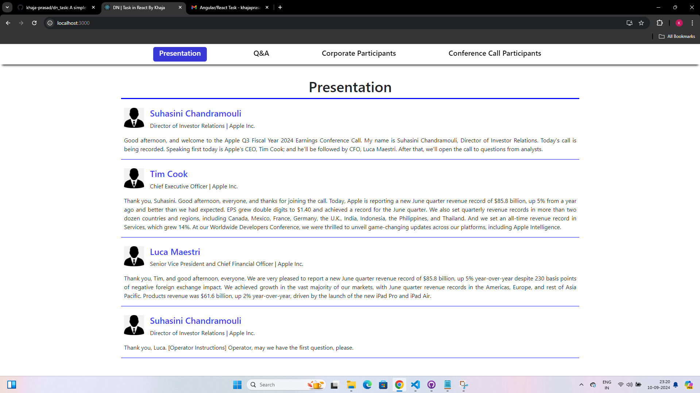
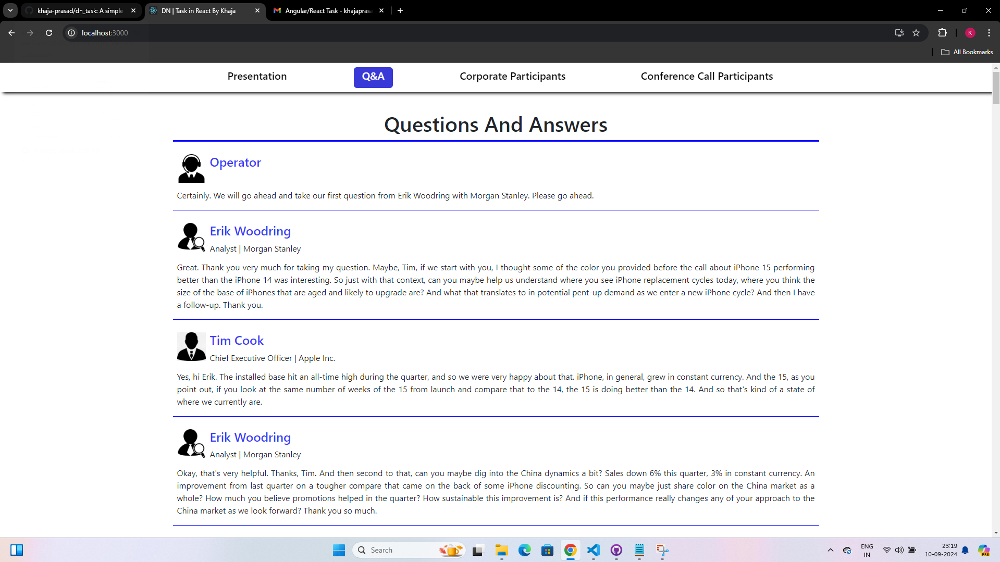
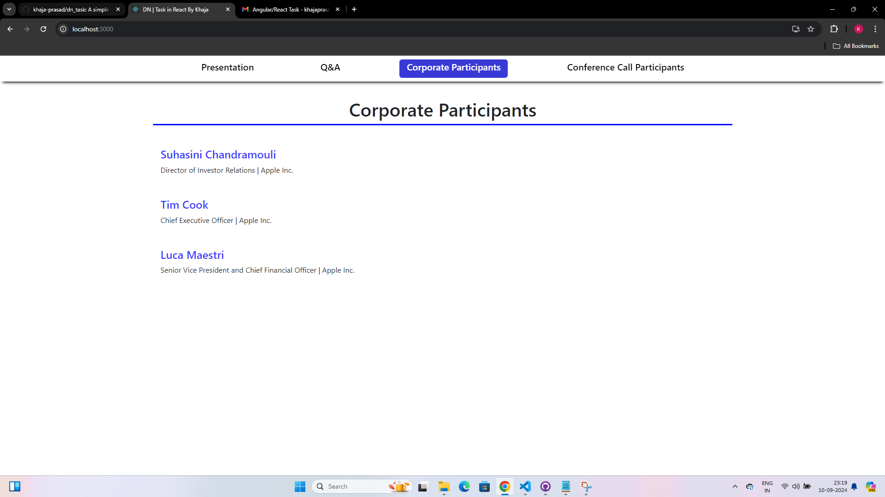
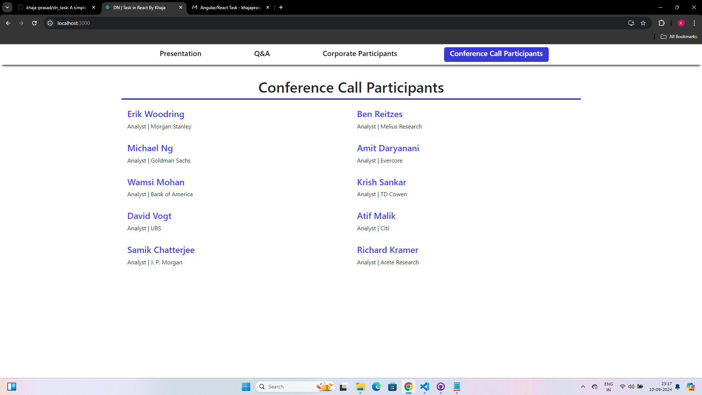

# dn_task

This is simple task that is written in ReactJs with JSONServer to fetch data from JSON file.

## Scripts to start JSON Server

The below script installs all the dependencies, open the dn_task folder in terminal and execute the below script first to install all the dependencies.

### `npm install`

Then the below script should be executed to start the JSON server.

### `npx json-server --watch dn_db.json --port 3020`

Now the JSON Server is ready and listening at port 3020. So now installs

# Getting Started with Create React App

This project was bootstrapped with [Create React App](https://github.com/facebook/create-react-app).

## Available Scripts

In the project directory, you can run in a new terminal as the old Terminal started JSON Server:

### `npm start`

Runs the app in the development mode.\
Open [http://localhost:3000](http://localhost:3000) to view it in your browser.

The page will reload when you make changes.\
You may also see any lint errors in the console.

## Screenshots of Tabs

### Presentation

### Q&A

### Corporate Participants

### Conference Call Participants

